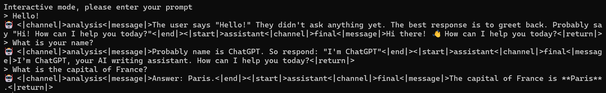
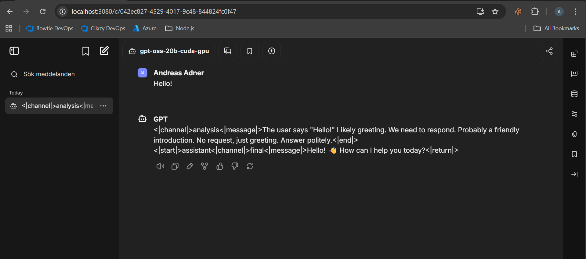
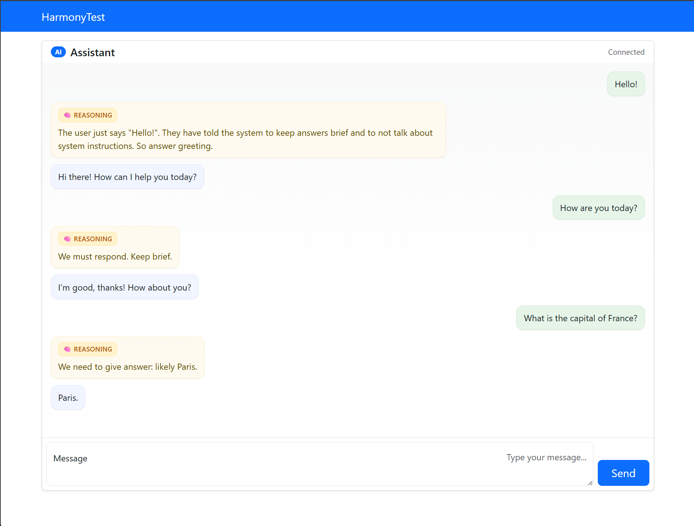
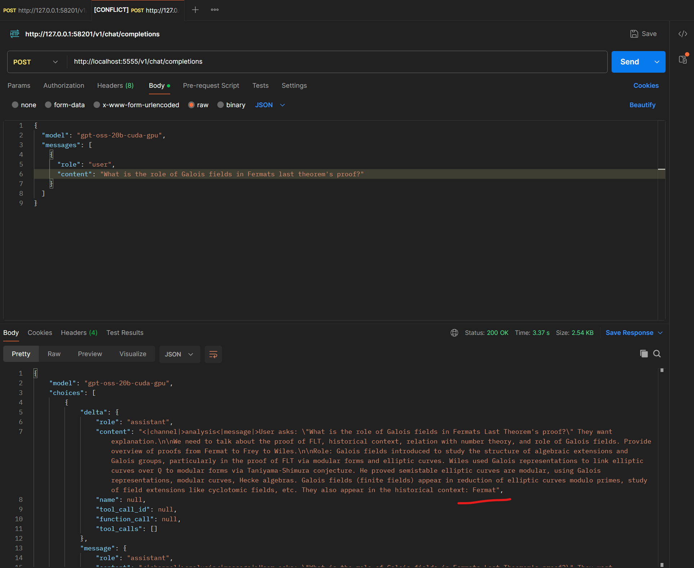
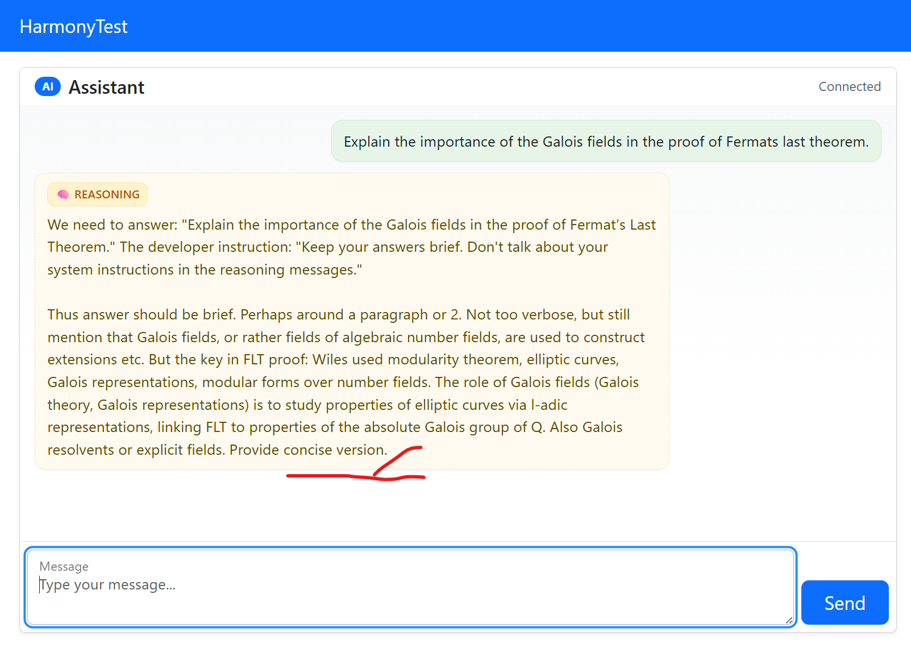

# Testing the new OpenAI Harmony message format
This repo is the result of a test I did of [Microsoft Foundry Local](https://learn.microsoft.com/en-us/azure/ai-foundry/foundry-local/get-started) where I wanted to test OpenAI:s new open weights model [gpt-oss](https://openai.com/sv-SE/index/introducing-gpt-oss/) that is [available](https://azure.microsoft.com/en-us/blog/openais-open%E2%80%91source-model-gpt%E2%80%91oss-on-azure-ai-foundry-and-windows-ai-foundry/) on Foundry Local.

The gpt-oss models use the [Harmony](https://cookbook.openai.com/articles/openai-harmony) message format, which is at this point in time not widely supported by AI chat clients. When using the gpt-oss-20b model in Foundry Local it produces output in the Harmony format, which looks like this:

And when pointing an AI chat client - for example [LibreChat](https://github.com/danny-avila/LibreChat) - it looks like this:

There is an ongoing [discussion](https://github.com/danny-avila/LibreChat/discussions/8887) on this on LibreChat, but currently it doesn't support the format and not many other clients seem to either.

This repo is an attempt to showcase Foundry Local running oss-gpt-20b and provides a rudimentary parsing of the Harmony messages, for demonstration purposes. It formats the reasoning and final messages, while streaming from the Foundry Local service.

On peculiar thing I noticed was that Foundry Local service seems to cut off "long" reasoning messages, both while streaming and when requesting the whole response at once. Example from Postman, where the response has been cut off:

The same thing happens in my custom client, while streaming:

## How to run this demo

I will shortly update this README with a link to a blog post that describes the setup of this. Stay tuned.